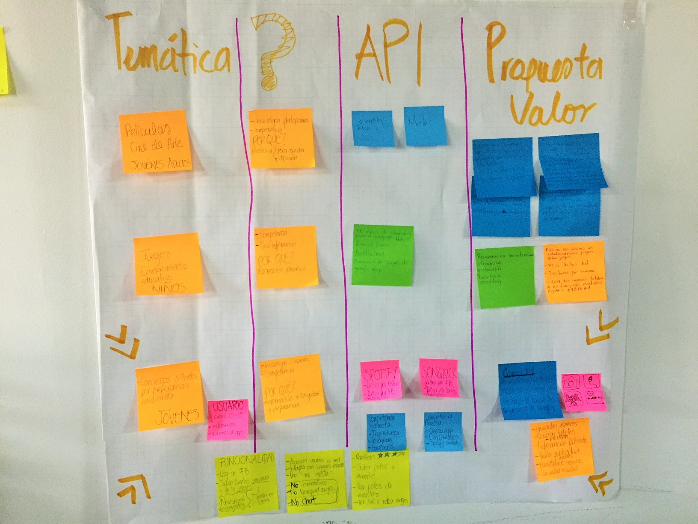
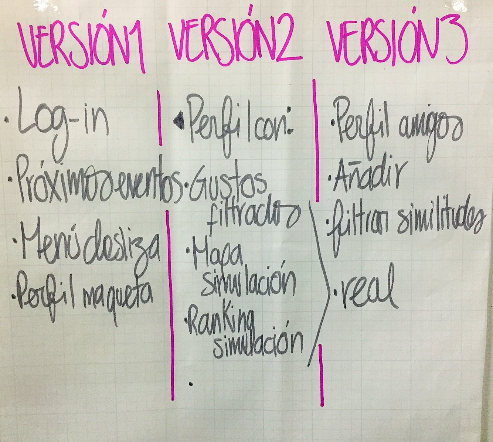
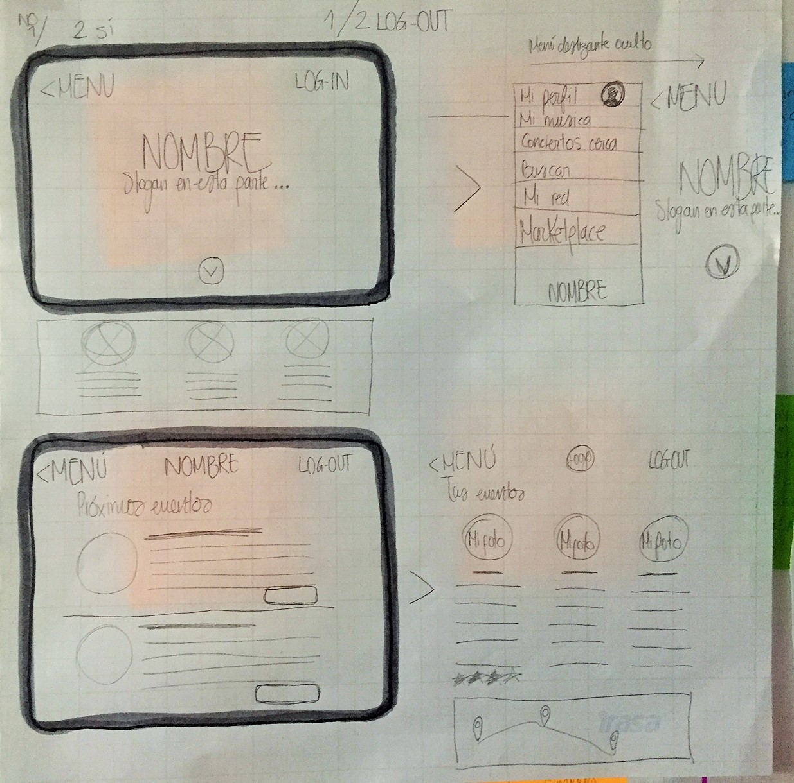
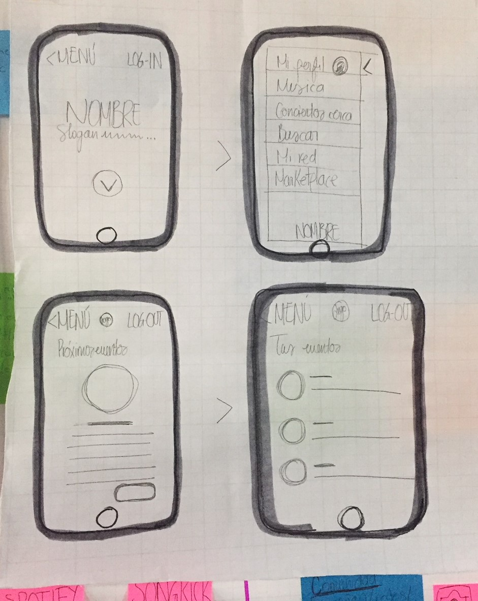

# My Track
Como parte del **_Challenge Hackathon_** se requiere plantear una plataforma, usando un API. La temática, es en torno a: *El entretenimiento*.

## Planeación

TRELLO: https://trello.com/b/AiykK3Rx/desarrollo

Como primera actividad, se genera una lluvia de ideas en el equipo sobre temáticas dentro del entretenimiento:

1. Películas de Cine de arte
2. Juegos de entretenimiento educativo
3. Conciertos filtrados por preferencias musicales

Para poder elegir un tema a desarrollar dentro del primer día de trabajo, realizamos una breve investigación de qué API sería pertinente en cada una de las opciones, y qué *Propuesta de valor* tendría cada una.

Al exponer los diferentes caminos y habiendo debatido sobre las necesidades que resolvían, el equipo optó por elegir la tercera opción, la cual se trata de forma más profunda en una plataforma que filtra los próximos eventos según tus preferencias musicales.

#### Propuesta de valor
Nuestra plataforma pretende ser una comunidad en torno a la experiencia de los usuarios en los conciertos. Desde cómo se acerca la información más relevante, hasta la forma de cómo comparte con sus amigos los conciertos a los que ha asistido.
Nuestra plataforma, busca dar información anticipada de los eventos, brindar la oportunidad de rankear los eventos según la experiencia, así como subir fotos que revivan la experiencia.

### Flujo de versiones

#### Funcionalidad:
**1ra etapa**
- Login FB
- Enlazar eventos cercanos ó de interés personal
- Newsfeed con eventos
**2da etapa**
- Rankear
- Mapa con lugares visitados
- Dar me gusta
**3ra etapa**
- Agregar usuarios a red
- Subir fotos a eventos
- ver  fotos de eventos
- Ver link a redes amigos

En esta etapa se realizan en base a los requerimientos, los wireframes en versión Desktop y Mobile.

## Maquetación
Se realiza primera etapa de maquetación.

https://roscolunga.github.io/my-track/
