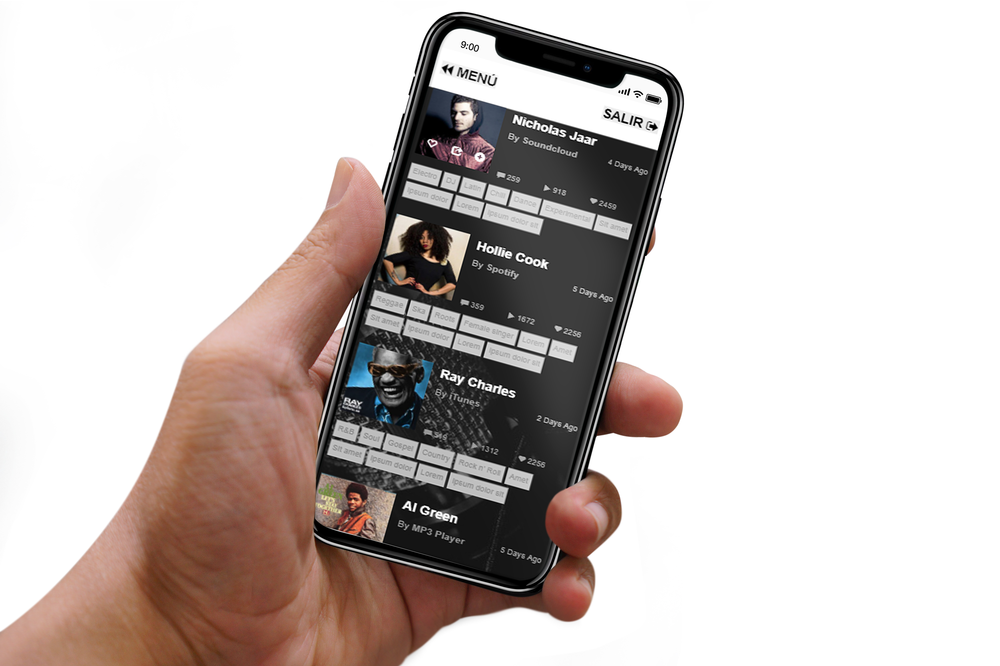

# My Track
Como parte del *_Challenge Hackathon_*, se desarrolla **My Track**, red social que busca generar una comunidad en torno a la experiencia de los usuarios en conciertos. Desde la búsqueda y adquisición de entradas, hasta la posibilidad de compartir momentos entiempo real, ubicaciones visitadas, rankear y comentar así como realizar la compra de souvenirs.

## Proceso

### Planeación

TRELLO: https://trello.com/b/AiykK3Rx/desarrollo

Como primera actividad, se genera una lluvia de ideas en el equipo sobre temáticas dentro del entretenimiento:

1. Películas de Cine de arte
2. Juegos de entretenimiento educativo
3. Conciertos filtrados por preferencias musicales

Para poder elegir un tema a desarrollar dentro del primer día de trabajo, realizamos una breve investigación de qué API sería pertinente en cada una de las opciones, y qué *Propuesta de valor* tendría cada una.

Al exponer los diferentes caminos y habiendo debatido sobre las necesidades que resolvían, el equipo optó por elegir la tercera opción, la cual se trata de forma más profunda en una plataforma que filtra los próximos eventos según tus preferencias musicales.

#### Propuesta de valor
Nuestra plataforma pretende ser una comunidad en torno a la experiencia de los usuarios en los conciertos. Desde cómo se acerca la información más relevante, hasta la forma de cómo comparte con sus amigos los conciertos a los que ha asistido.
Nuestra plataforma, busca dar información anticipada de los eventos, brindar la oportunidad de rankear los eventos según la experiencia, así como subir fotos que revivan la experiencia.

### Flujo de versiones

#### Funcionalidad:
**1ra etapa**
- Login FB
- Enlazar eventos cercanos ó de interés personal
- Newsfeed con eventos
**2da etapa**
- Rankear
- Mapa con lugares visitados
- Dar me gusta
**3ra etapa**
- Agregar usuarios a red
- Subir fotos a eventos
- ver  fotos de eventos
- Ver link a redes amigos

En esta etapa se realizan en base a los requerimientos, los wireframes en versión Desktop y Mobile.

## Trabajo en equipo

**Tarin Ayala**
#####  Mi Contrubución en nuestra aplicación my track:
Proceso de planeación, acciones estimadas con el fin de obtener un objetivo.
Investigación de API.
Prtoceso de desarrollo: Funcionalidad de agregar foto, agregar comentario.

**Diana Colmenero**
- Mi contribución para nuesta app ***my-track*** consistió en la investigación del Api de Spotify y ticketmaster. Logrando obtener el Widget de los eventos mas recientes.
- Contribuí también con las funciones para el inicio de sesión con Facebook, Google, lograr que apareciera ese nombre en la vista del menú y cerrar sesión de manera correcta.
- Además ayude a mi compañera a resolver algunos conflictos con la función para subir imagenes.

**Rosa Colunga**
##### Mi contribución dentro del trabajo en equipo fue
- Coordinación y dirección del equipo.
- Dentro del proceso de *planeación*, el planteamiento de la idea que posteriormente desarrollamos más ampliamente en equipo.
- Proceso de *diseño*, realizando bocetos de la interfaz (wireframes), arquitectura de la información, elección de paleta de color.
- *Front-end*. Maquetación básica de la web-page. Vistas: Inicio, parte incial de *newsfeed*, artistas y perfil.

**Carmen Vega**
- Mi contribución para ***my-track*** consistió en la investigación del Api de Spotify y last.fm para eventos de música.
- Contribuí también en la maquetación de las vistas marketplace y newsfeed

## Resultados

**Responsive Web Design**
El sitio está habilitado para mostrarse en todos los tamaños de dispositivos, habiendo hecho uso del Framework Bootstrap para facilitar este requerimiento.

**Inicio de Sesión**
Se cuenta con 3 diferentes opciones de ingreso:
- Nombre y contraseña 
- Vinculando cuenta de Facebook
- Por medio de la cuenta de Google

Por medio de la aplicación de Firebase, se logra mostrar los datos del usuario de inicio de sesión.

**Aristas y Marketplace**

